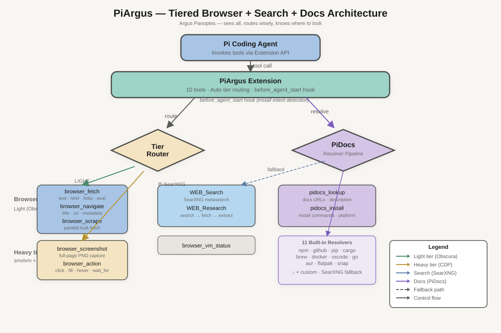

# PiArgus

**Two-tier browser extension for Pi** — Obscura (light) + smolvm/Chromium (heavy).

Named for Argus Panoptes, the hundred-eyed giant of Greek myth who sees all.

## Architecture

| Tier | Engine | Use Case |
|------|--------|----------|
| Light | Obscura (V8, 30MB) | Fetch, scrape, eval, links, text |
| Heavy | smolvm + Chromium | Screenshots, clicks, forms, GPU rendering |

Routes automatically — no manual tier selection needed.



## Requirements

- **Light tier**: [Obscura](https://github.com/obscura-browser/obscura) (`~/.local/bin/obscura`)
- **Heavy tier**: [smolvm](https://smolmachines.com) (`~/.local/bin/smolvm`)

Heavy tier is optional — light tier works standalone.

## Install

```bash
pi install git:github.com/genegulanesjr/PiArgus
```

Or, once published to npm:

```bash
pi install npm:piargus
```

## Test

```bash
npm test
```

## Tools

| Tool | Tier | Description |
|------|------|-------------|
| `browser_fetch` | Light | Fetch page as text/html/links/eval |
| `browser_navigate` | Light | Navigate & get page metadata |
| `browser_scrape` | Light | Bulk parallel scraping |
| `browser_screenshot` | Heavy | Full-page screenshots via Chromium |
| `browser_action` | Dual | JS eval (light) or click/fill/hover (heavy) |
| `browser_obscura_serve` | Both | Status check / pre-warm heavy VM |
